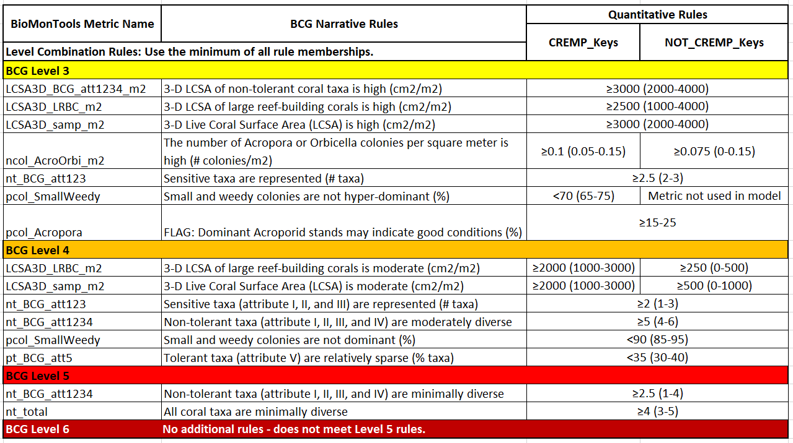

```{r setup, include=FALSE}
knitr::opts_chunk$set(echo = FALSE
                      , results = 'asis'
                      , warning = FALSE
                      , message = FALSE)
```

# Background

This web app calculates Biological Condition Gradient (BCG) scores for
the coral/benthic assemblage of Florida's Coral Reef ecosystem (Figure
1). The BCG is a conceptual model that describes how biological
attributes of aquatic ecosystems change along a gradient of increasing
human disturbance. The USEPA has published a practitioner's guide to BCG
development that would be useful introductory reading for someone new to
the BCG framework
(<a href="https://www.epa.gov/sites/default/files/2016-02/documents/bcg-practioners-guide-report.pdf" target="_blank">USEPA
2016</a>).

A BCG model that was initially developed for the Caribbean coral reef
ecosystem, has been applied to the near shore coral reefs within Florida
jurisdictional waters (Florida's Coral Reef), including sites in the Dry
Tortugas, the Florida Keys, Biscayne National Park, and up the eastern
coast of Florida to Martin County. Through an iterative process,
scientists from throughout Florida used survey data and expert knowledge
to develop quantitative decision rules to describe six levels of coral
reef ecosystem condition. A report on the development of the Florida
Coral BCG models is forthcoming.

Want to try running the calculator but don't have input files? Download
the
<a href="https://github.com/Blocktt/ShinyAppDocuments/tree/main/FLCoral_BCGCalc/Example_Files/" target="_blank">Florida
BCG Test Files </a>.

{width="75%"}

Figure 1. Florida coral reef sampling sites (N = 4,884).

# Funding and acknowledgments

The Florida Department of Environmental Protection (DEP) funded and
collaborated in the research described here through contract WQ168.

We are grateful for the hard work, insights, commitment, and enthusiasm
provided by the experts who developed the BCG.

# Intended application

The FL Coral BCG improves the diagnostic ability of practitioners to
identify degradation in biological integrity and water quality. It is
intended to be applied to coral samples that meet the following
criteria:

**Geographic area**: Florida's Coral Reef. Regions therein include the
Dry Tortugas, Marquesas, Lower Keys, Middle Keys, Upper Keys, Biscayne,
and Southeast Florida.

**Taxonomic resolution**: Demographic data to lowest practical taxonomic
level.

**Collection gear and method**: Diver surveys along an established
transect noting coral morphological characteristics.

For more information on sampling methodologies and application limits,
see the
<a href="https://raw.githubusercontent.com/Blocktt/ShinyAppDocuments/main/FLCoral_BCGCalc/Reports/Placeholder.docx" target="_blank">Florida
Coral BCG development report</a>.

# Coral models

Table 1 summarizes the Florida Coral BCG metrics, metric membership
rules, and level membership rules. Note, that Table 1 has two columns
for quantitative rules depending on the data source (CREMP_KEYS or
NOT_CREMP_KEYS).

{width="75%"}
